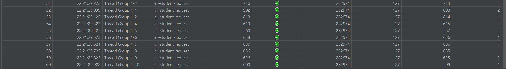
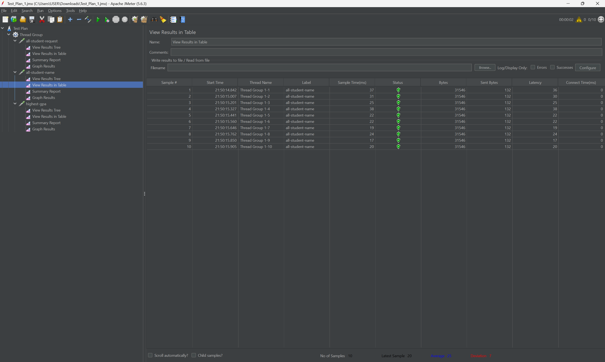
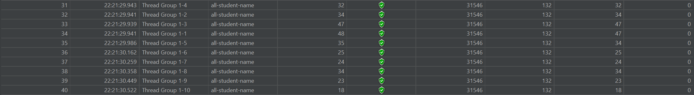
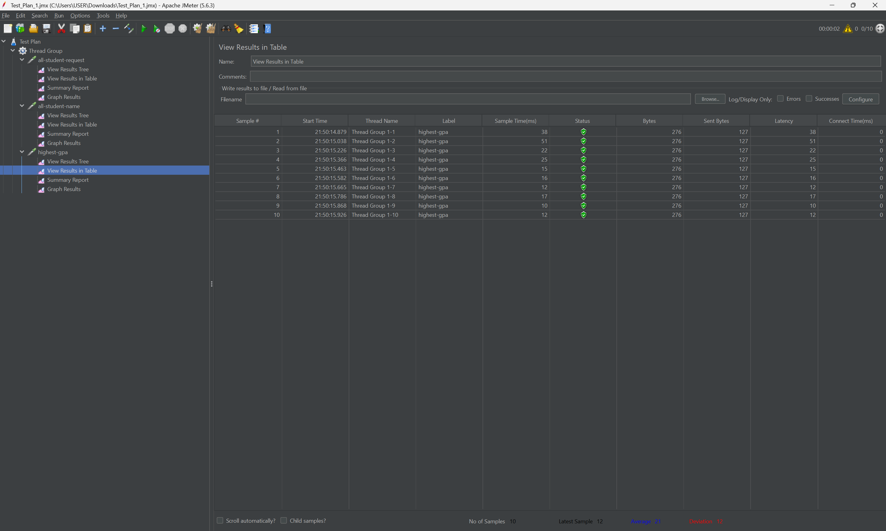
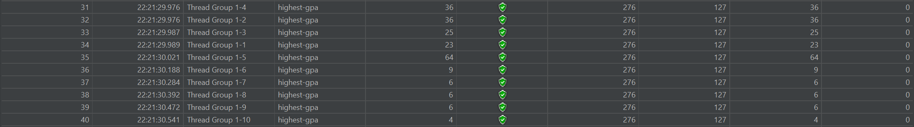
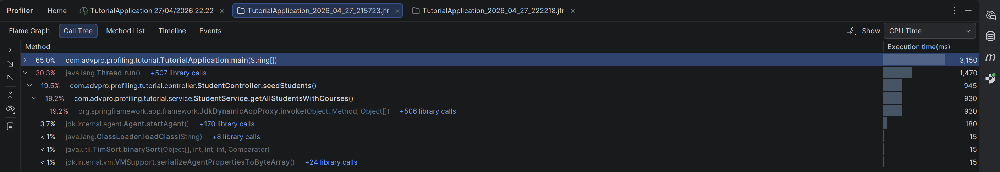
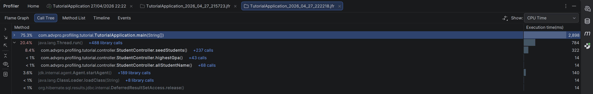
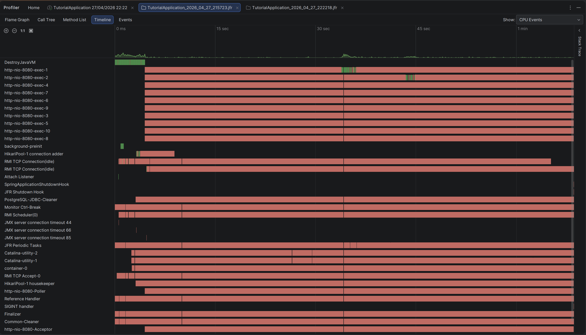
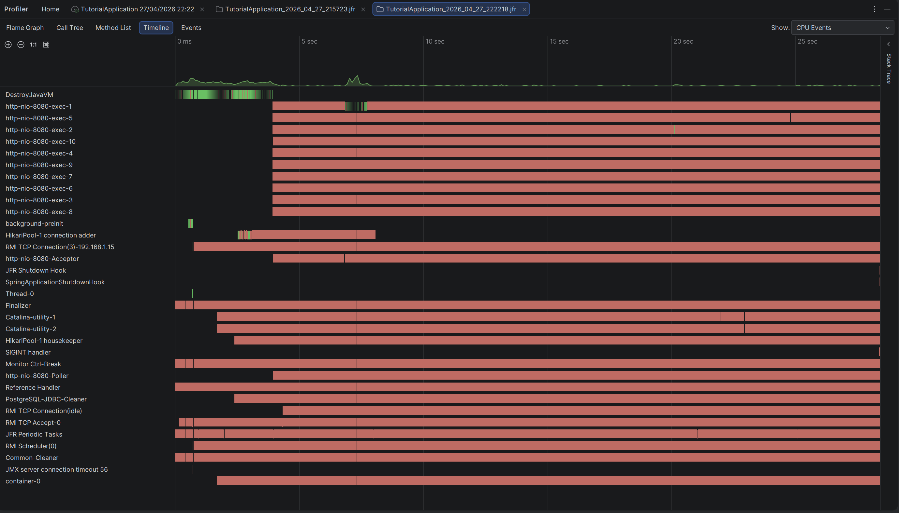

## Performance Testing & Profiling

### 1. JMeter: `/all-student` Endpoint

**Before Optimization:**
Tidak ada (lupa screenshot), tapi average sample time sekitar 2-3k ms

**After Optimization:**

### 2. JMeter: `/all-student-name` Endpoint

**Before Optimization:**

**After Optimization:**

### 3. JMeter: `/highest-gpa` Endpoint

**Before Optimization:**

**After Optimization:**

### 4. IntelliJ Profiler: Call Tree & Timeline

**Call Tree (Before vs After):**

**Timeline (Before vs After):**

---

Berdasarkan hasil pengujian performa menggunakan JMeter sebelum dan sesudah optimasi, terdapat peningkatan (
*improvement*) yang sangat signifikan, khususnya pada *endpoint* `/all-student`.

Pada pengukuran awal, *endpoint* `/all-student` mencatat rata-rata *Sample Time* di kisaran **~2000ms**. Setelah
dilakukan *refactoring* dengan memanfaatkan `findAll()` untuk mengeliminasi masalah N+1 *query*, *Sample Time* berhasil
ditekan turun secara drastis menjadi kisaran **~600ms** (peningkatan performa sebesar ~70%).

Untuk *endpoint* `/all-student-name` dan `/highest-gpa`, metrik JMeter menampilkan angka yang secara sekilas tampak
setara (stabil di kisaran **20ms - 30ms**). Hal ini terjadi karena pengukuran JMeter bersifat
*black-box* dan mencakup seluruh latensi jaringan serta *overhead* dari *framework* Tomcat/Spring (I/O *bound*).
Mengingat skala *data seeding* yang relatif kecil (sekitar 2k students & 10
courses [hal ini sengaja saya lakukan karena jika terlalu banyak akan memakan waktu yang lama]), komputasi *in-memory*
di dalam CPU mengeksekusi proses tersebut jauh
lebih cepat daripada latensi jaringan itu sendiri. Perubahan performa yang sesungguhnya dapat divalidasi pada hasil
tangkapan **IntelliJ Profiler** (Call Tree), di mana *Execution Time* untuk kedua *method* tersebut telah berhasil
diturunkan hingga di bawah **15ms**.

Maka dari itu, optimisasi yang diimplementasikan telah berhasil mencapai target, meningkatkan efisiensi eksekusi
*in-memory*, serta memitigasi *bottleneck* pada siklus I/O *database*.

---

## Reflection

### 1. "What is the difference between the approach of performance testing with JMeter and profiling with IntelliJ Profiler in the context of optimizing application performance?"

Pendekatan pengujian dengan JMeter berfokus pada evaluasi performa dari sudut pandang eksternal (*black-box testing*).
JMeter mensimulasikan beban *user* yang besar untuk mengukur metrik seperti *throughput* dan total *response time* yang
mencakup keseluruhan siklus *request*, termasuk latensi jaringan dan *overhead framework* (I/O *bound*). Sebaliknya,
IntelliJ Profiler bekerja dari dalam aplikasi (*white-box profiling*), mengukur secara presisi metrik internal seperti
*CPU Time*, alokasi memori, dan status *thread* hingga ke level eksekusi *method* (*CPU/Memory bound*).

### 2. "How does the profiling process help you in identifying and understanding the weak points in your application?"

Proses *profiling* memberikan visibilitas mendalam mengenai bagaimana aplikasi mengalokasikan *resource*-nya di bawah
kap mesin. Melalui representasi visual seperti *Call Tree* dan *Timeline*, saya dapat secara spesifik mengidentifikasi
*method* mana yang menjadi *bottleneck*. Sebagai contoh, *profiler* membantu saya melacak bahwa kelambatan sistem secara
langsung disebabkan oleh inefisiensi pemanggilan *database* yang berulang di dalam sebuah *loop* (masalah N+1 *query*)
pada implementasi awal `StudentService`.

### 3. "Do you think IntelliJ Profiler is effective in assisting you to analyze and identify bottlenecks in your application code?"

IntelliJ Profiler tentu saja sangat efektif dalam mengidentifikasi *bottleneck* pada kode aplikasi. Berdasarkan
pengujian, *profiler* secara akurat menunjukkan
tingginya persentase beban CPU pada implementasi awal `getAllStudentsWithCourses` (memakan ~930ms). Setelah dilakukan
*refactor*, *profiler* kembali memvalidasi keberhasilan optimasi dengan menunjukkan penurunan *CPU Time* secara
signifikan.

### 4. "What are the main challenges you face when conducting performance testing and profiling, and how do you overcome these challenges?"

Tantangan utama yang saya hadapi adalah adanya bias pengukuran pada iterasi pertama akibat *Just-In-Time* (JIT)
*compiler* pada ekosistem JVM yang belum mencapai tingkat optimal (*warm-up phase*). Selain itu, membedakan lambatnya
aplikasi akibat tingginya komputasi CPU atau antrean *Network* I/O juga cukup menantang. Saya mengatasi hal ini dengan
mengeksekusi *endpoint* beberapa kali terlebih dahulu untuk memanaskan *environment* sebelum mengambil sampel metrik,
serta melakukan triangulasi data antara hasil JMeter (waktu total) dan *profiler* (waktu komputasi murni).

### 5. "What are the main benefits you gain from using IntelliJ Profiler for profiling your application code?"

Manfaat paling signifikan adalah kemampuan untuk melakukan *targeted refactoring*. Alih-alih melakukan optimasi secara
asal2 an pada seluruh bagian aplikasi, *profiler* dapat menyajikan data yang
mengarahkan saya tepat ke akar masalah. Hal ini memungkinkan saya untuk fokus memperbaiki struktur data (seperti
perpindahan dari rekursi String manual ke *Stream API/StringBuilder*) dan menyempurnakan efisiensi *query* yang
benar-benar membebani memori dan prosesor.

### 6. "How do you handle situations where the results from profiling with IntelliJ Profiler are not entirely consistent with findings from performance testing using JMeter?"

Ketidakkonsistenan metrik, seperti yang terjadi pada *endpoint* `/all-student-name` dan `/highest-gpa`, adalah hal yang
dapat dijelaskan karena perbedaan instrumen pengukurannya. JMeter tidak mencatat peningkatan kecepatan yang drastis
karena batasan waktu respons sudah tertutupi oleh latensi *overhead network/HTTP framework*, bukan lagi logika bisnis.
Dalam situasi ini, saya mengambil keputusan berdasarkan temuan IntelliJ Profiler yang membuktikan bahwa *CPU Time* telah
berhasil diturunkan. Ini menandakan optimisasi berhasil melakukan stabilitas *resource* aplikasi (mencegah
pembesaran objek di memori dan siklus *Garbage Collector* yang besar), terlepas dari batas I/O *overhead* pada skala
data kecil.

### 7. "What strategies do you implement in optimizing application code after analyzing results from performance testing and profiling? How do you ensure the changes you make do not affect the application's functionality?"

Strategi optimisasi yang saya terapkan meliputi:

1. Pendelegasian komputasi berat (seperti pencarian nilai tertinggi/*sorting*) ke *engine database* dengan memanfaatkan
   fungsionalitas JPA.
2. Eliminasi masalah N+1 *query* melalui penarikan relasi data secara langsung.
3. Utilisasi struktur data yang *memory-efficient* (menghindari concat String di dalam *loop*).

Untuk memastikan fungsionalitas aplikasi tidak mengalami penurunan, saya secara ketat memvalidasi *return type* dari
setiap *method* agar tetap mematuhi data type awalnya, serta melakukan pengetesan *endpoint* untuk menjamin bahwa format
respons JSON yang dihasilkan aplikasi tetap identik dengan versi sebelum *refactor*.